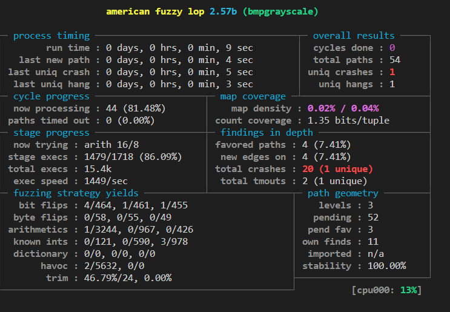
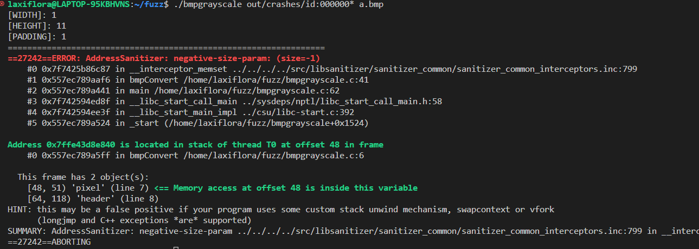

# Fuzzing test unique crash



# Result



# Instructions
```sh
$ cd Lab07
$ export CC=~/AFL/afl-gcc
$ export AFL_USE_ASAN=1
$ make
$ mkdir in
$ cp test.bmp in/
$ ~/fuzz/AFL/afl-fuzz -i in -o out -m none -- ./bmpgrayscale @@ a.bmp
```